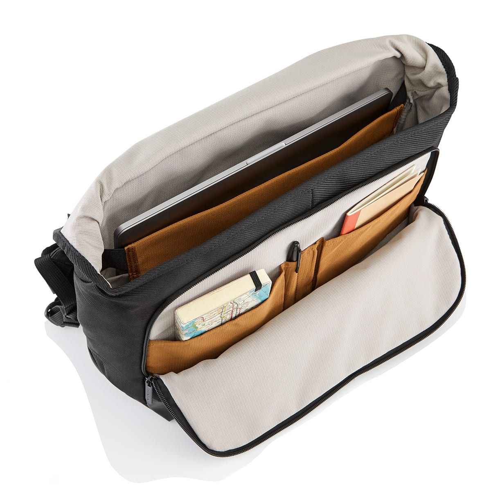

The <em>everyday carry</em> are those items you always have with you — keys, wallet, phone — and anything you cart from, say, home to office during the week, such as pens, a laptop, notebook, etc. When people try to <em>design</em> their EDC, it is usually with a view to minimizing "stuff" while maximizing utility or preparing for possible emergency situations.
In my case, I'm trying stop myself from carting every damn thing I own.

## Essentials

- Minimalist wallet with bank cards, ID and access cards, and multitool
- Orbitkey keyring
- Car keys
- Oneplus Five

I don't always wear a watch, but I do like them for some reason.

## Work Pack: Crumpler Chronicler^+^

Ooooookay, so I really didn't need to buy a new bag, but hey, I'm starting a new job on Monday so wanted to spoil myself — and it was half-price on special. 

Contents:

- Macbook Pro (A1990 Core i9)
- Power supply and cables
- USB drive
- Notebook (Field Notes?)
- Fisher Spacepen, Jinhao fountain pen
- Headphones (Jabra Move)
- Hand sanitiser
- Blue-blocker glasses
- Skeletool

## Weekend Pack: Macpac UTSIFOY

* Wacaco portable espresso pump
* Steel water bottle + cover
* LED torch

## Modules

### Survival

* Multitool
* Signal mirror
* Torch
* Fishing line
* Fire-starting:
  * BIC lighter
  * Striker steel
  * Zippo lighter
  * Matches
* Whistle
* Blanket
* Compass
* Spork

### FAK

* Small red FAK from eBay
* Bandages &amp; bandaids
* Hemp hand creme (because I'm worth it)
* Small Swiss-army knife (blade, scissors, file)
* Nail clippers
* Tissues
* Bottle-opener (which can double as a signal mirror)
* Antihistamines
* Ibuprofen (pain-killer), cold and 'flu, anti-nausea/migraine
* Antiseptic wipes

### DOPP kit

* Wipes (coconut)
* Deodorant
* Beard comb
* Toothbrush and paste

### Clothing (cube)

* Raincoat
* Beanie
* Gym gear (in dry-sac): 
  * shorts, shirt, underwear, socks
  * In shoe bag: Vibram Fivefingers®
  * Quick-dry towel