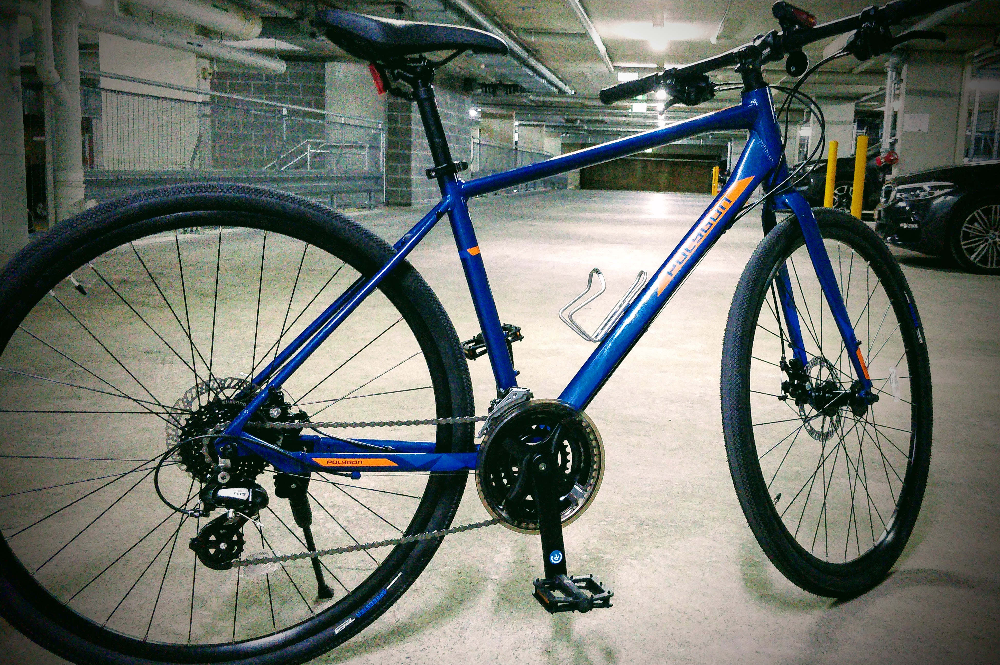

You may have heard: we're in the midst of a global pandemic[^1]. As such, many communities are practicing "social distancing" and self-isolation; in Sydney we've been asked to stay home as much as possible, limit contact with those we don't actually live with, and only go out for essentials like toilet paper, hand sanitiser and, Aussies being aussies, copious amounts of booze.

[^1]: ... and if you haven't heard then stay wherever it is you've been hiding. COVID-19 is the virus sweeping the globe, with over 2 million cases confirmed worldwide and 145,000 deaths so far. Not the greatest thing to have happened, but we're all sort of pulling together.

Thankfully we're also allowed out for exercise, and so this week I bought new bikes for all of us.

They've been on the cards for a while: our "old" bikes were neglected and rendered unrideable[^2] or, in the case of Jules' BYK E350, well and truly outgrown. As such I've been researching, and finally settled on a reasonably priced commuter/urban bike from Polygon (good reviews and the paintwork really appealed to me). Not only that, but available online and ready to ship as soon they'd been built and tuned then partially disassembled and packed back into the manufacturers box.

[^2]: Not _entirely_ our fault, this one. We both commuted for a good few seasons, but when we moved into a property with a shed the bikes went there for a while. Turns out the shed leaked, so the next time we checked on them they'd started to rust – and we had a bunch of damp boxes to deal with first. I **do** have plans to fix 'em up, if only for the practice, but that's a tale for another time.

Now we're not the fittest at the moment — being stuck at home 24/7 hasn't helped, since shopping is a biohazard nightmare and the delivery list is long and delicious — but we've been enjoying getting out to the tennis courts and video-calling Dee's yoga teacher on a Saturday morning and cycling seemed like a natural thing to get into. Of course, based on the bike shops it seems like a lot of people have had the same idea!

Anyway, the bikes arrived today and I spent my lunchtime reassembling Dee's Polygon Path 2. Everything was going well until I tried to inflate her front tyre: the bike fell from the kickstand and in the process of grabbing it (to protect the paintwork!) I snapped the valve off the inner-tube!

Back to the bike store tomorrow for a new tube and then assembling my Polygon Path 3, but for now it's time to sit up in bed with a saison from the local craft brewery and watch something on Netflix.

Or maybe bicycle restoration and repair videos. It's my new favourite [hobby](/notes/hobbies/overview)!

