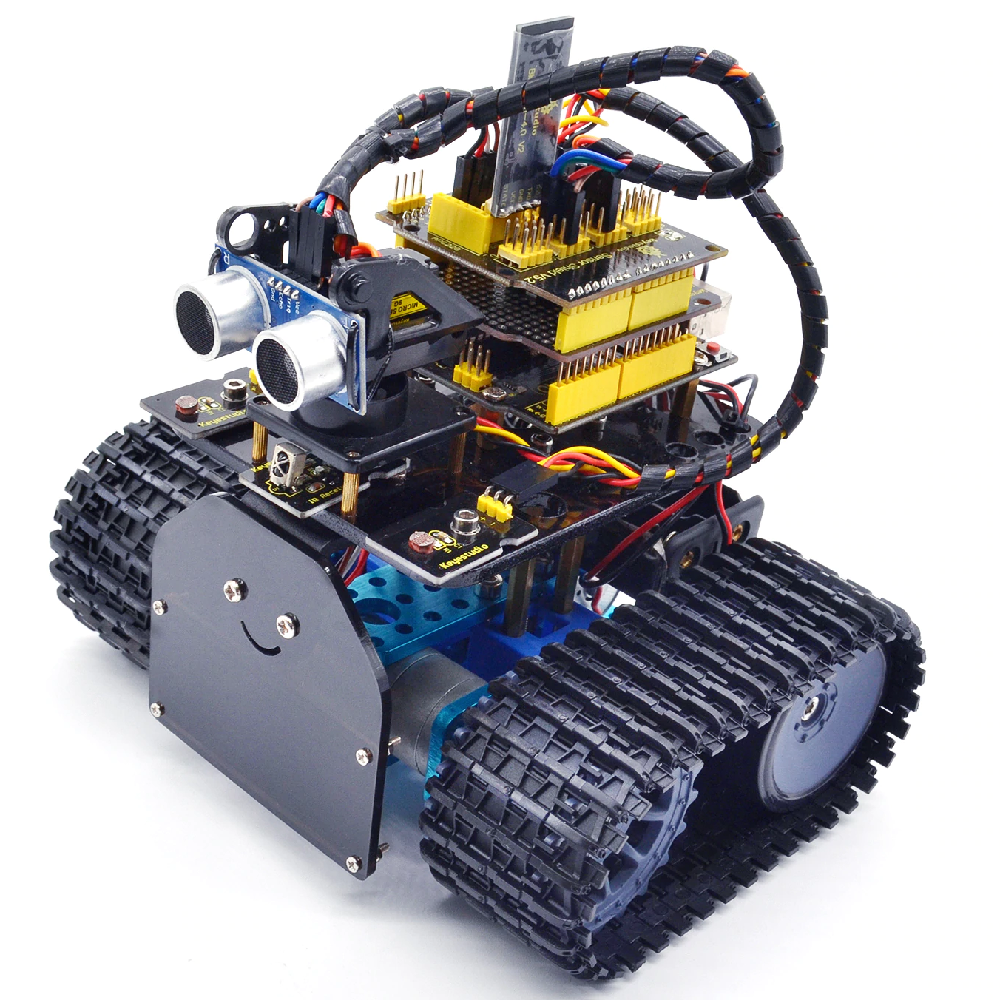

I've been talking to Jules about building a robot with him this year, and tonight I found this neat kit on Aliexpress: less than $100AUD, Arduino-based and with enough complexity for the two of us to have some fun building and programming it. It looks a _little_ like WALL-E, which is a toy he has been playing with consistently for the last week, and I figure we can even make and decorate a cardboard shell for the little guy (he loves making stuff out of cardboard).

Ultrasonic distance sensors, looks like infrared, RC via Bluetooth and a Scratch-like programming language. Could be a great little 'bot!'

## Tech Specs

1. Motor parameters: 6V, 150rpm/min. 
2. Motor control by L298P driver shield with power switch.
3. Equipped with Bluetooth wireless module, can remotely control the robot after pairing with mobile phone Bluetooth. Only support Android system.
4. With IR receiver module, pairing infrared remote control to control the tank robot.
5. With Photocell module, detecting the light intensity on both sides of tank robot to control the tank robot.
6. With the ultrasonic module, measuring the distance between the obstacles and tank robot.
7. Can access to external 7~12V power supply; match various sensor modules to realize various functions according to your imagination.
8. Providing the Mixly software and test code, easy to play and simple.

