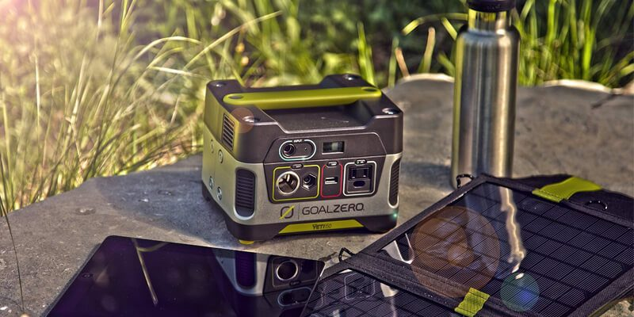
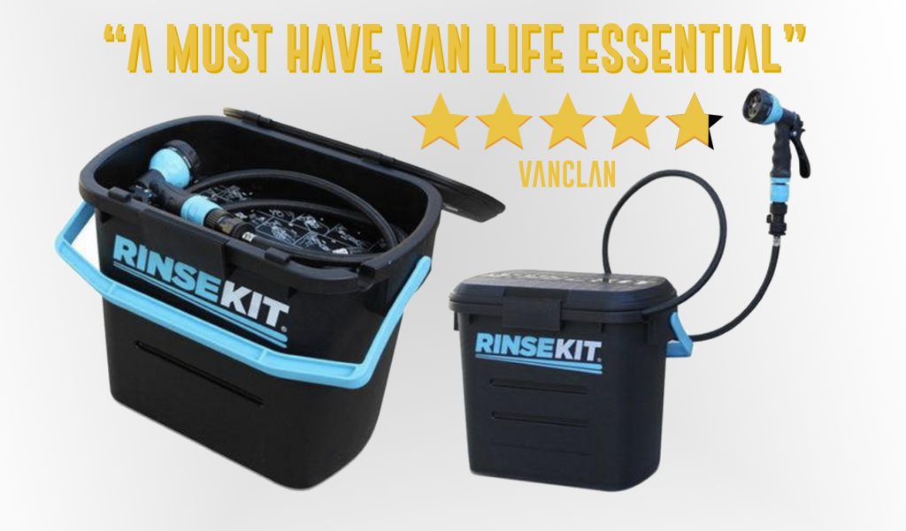
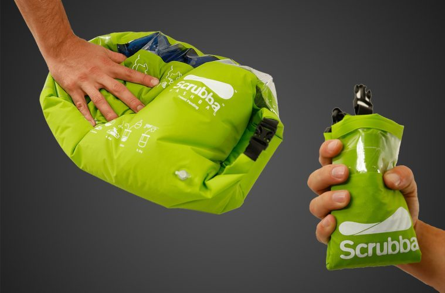
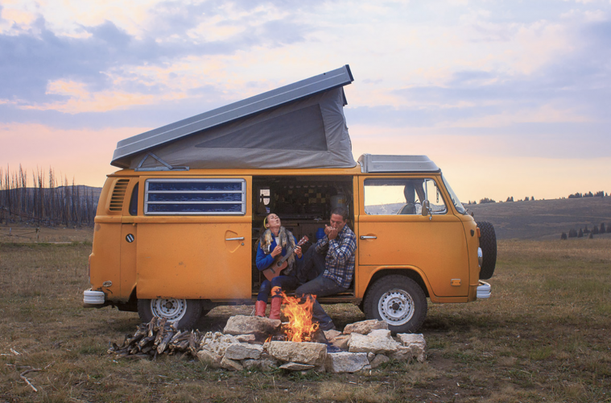
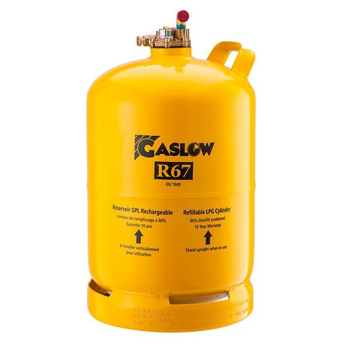
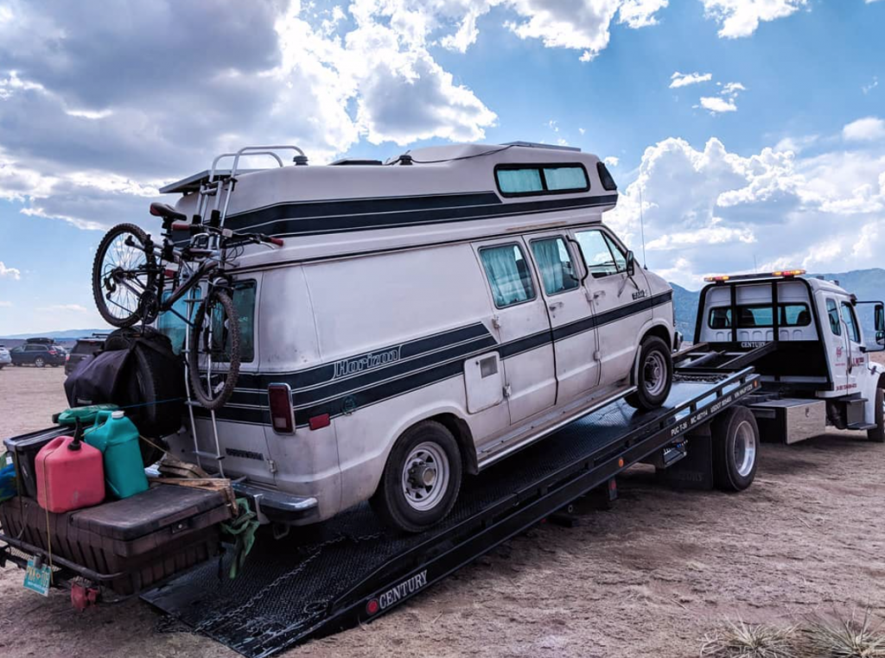
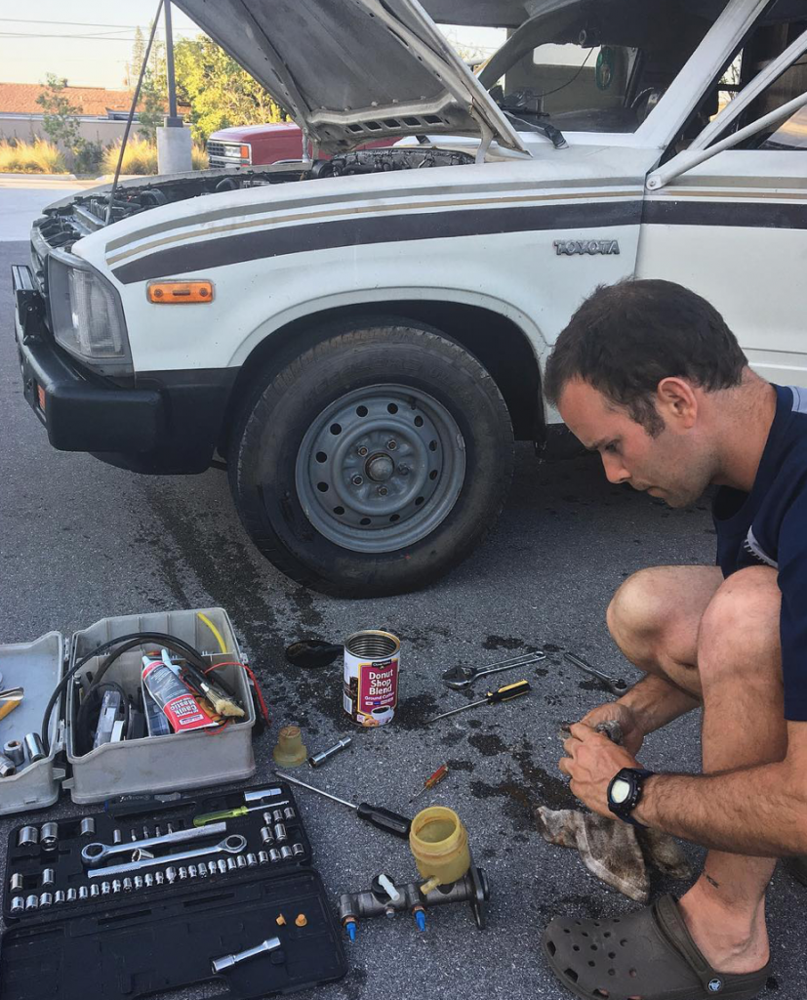
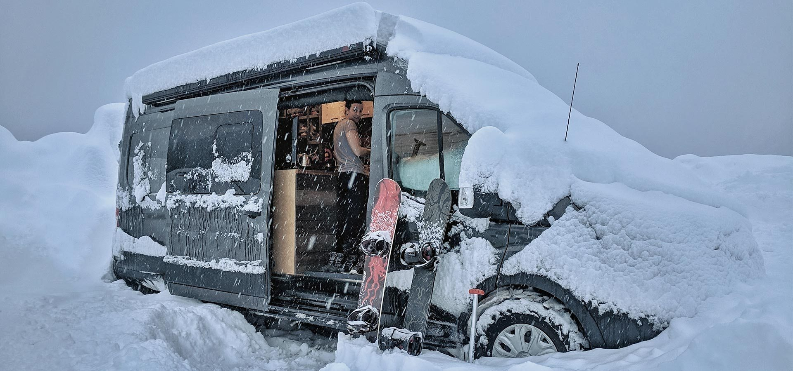
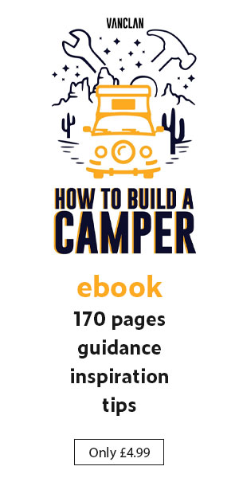

*A man, a van, a Canal Panama*

Man, I wish I was retired. This is one of those hobbies that I'd love to pour all my time into: buying a cheap old van ($1000) and converting it into something that we could tour around (the populated coast of) Australia — an urban adventure rather than "goin' walkabout", but one in which we can have the fun of camping without ever having to use a drop toilet.

It's not going to happen for a while, sure, but one day I'd love to give it a go.

1. Living The Van Life In Such a Small Space**
2. Adventures Just Happen
3. Community Vibes
4. You Should Definitely Buy a Hightop
5. Rainy Days Are Perfect For Hanging Out
6. Healthy Eating Isn’t That Hard
7. You Can Go On A Shopping Spree
8. Charging Stuff Takes Time**You don’t think about how much time your computer and phone takes to charge – and then how quickly the battery dies again; until you live the van life!We had a two-pronged approach to making sure that we’d always have enough power/everything charged, but we were sorely unprepared.The first part of our plan was to work from coffee shops, that way we could charge our computers and phones easily every day.Second, we bought a hella expensive lithium battery pack, our plan was to take this with us to coffee shops most days to charge it up for evening and weekend computer use.We bought the [Goal Zero Yeti 400](https://www.amazon.co.uk/Goal-Zero-Universal-Solar-Generator/dp/B00JJDPTYQ/ref=sr_1_1?s=sports&ie=UTF8&qid=1516050746&sr=1-1&keywords=Goal+Zero+Yeti+400) after masses of research, but there were a few things we didn’t think take into consideration. It’s cumbersome to lug around, charging takes five to seven hours, and it doesn’t power stuff for very long.Don’t get me wrong, we love our Goal Zero and wouldn’t want to live without it, but we had this stupid idea that it would be like having constant power like you would in a house.**
   5. 7. 9. 
         10. 
         11. 
         12. Being Sick Sucks And Happens**Pretty soon after hitting the road, I managed to get sick, I’m not talking about your run of the mill cold – nope, this was me throwing up non stop for days. And for us telling you how to live the van life, just be prepared for this to happen once or twice!This is the only time that I felt as though I didn’t want to be in the VW, and as luck would have it – we were visiting David’s Godmother’s at the time, so we did take a break from vanlife and stay in her guest house.It wouldn’t be impossible to be sick in the VW, but I would have felt bad for David having to be in there with a very sick me.**
         13. 10. 
             11. 
             12. Convenience Is No Longer For You**In the age of apps, convenience is king, and it’s easy as pie to do just about anything, from ordering takeout and buying stuff online, to taking daily showers and watching Netflix, everything we want is instant and easy. But not so much for us anymore.We don’t have an address, so if we want to order something online, we either have to get it shipped to a friend’s house and then pick it up, or do without.Takeout doesn’t happen, I guess this is a good thing, but it doesn’t feel that way on a Friday night when you’re craving Thai food.Planning bathroom breaks, and finding showers does take thought and effort, and on a Sunday when you’re driving past closed shops, and can’t find a public restroom anywhere it can make you miss apartment life.And of course then there’s watching Netflix or TV – you always have to think about how much charge your computer has, and how much data you have left on your Mifi plan!11. Keeping Clean On The Road Is Easier Than You ThinkOne of the first things people think when they plan to take on the van life is usually “how do I keep clean?” or “how do I shower”, and from experience this is one of the least things you should be worrying about. It depends on where you are in the world, and what you’re doing. For example, we have travelled the east coast of Australia and we came across hundreds and hundreds of community toilets and showers, most of them being absolutely free. But on the other hand you could be driving through europe and you won’t see one for days.So, we have a solution, it’s called the [Rinsekit](https://vanclan.co/rinsekit/), it’s a pressure shower in a portable tub. That doesn’t sound too appealing but it works, and it works well, trust us. Fill this beauty up at a standard water point, it will pressurise itself, and you’ll have a high-pressure shower for up to 6 minutes. But is it warm I hear you ask? If you use a warm water spout then yes, if not, you can buy an additional heating rod, which will actually heat up the Rinsekit while you travel so you can have a warm shower waiting for you when you arrive at camp. If that’s a little expensive then there’s plenty of portable showers on the market, take your pick, we recommend one that’s black so it attracts heat allowing you to warm it up on your campervan bonnet when it’s sunny. Oh, and you can clean dishes, surfboards and even your van life pet with the Rinsekit. It’s seriously worth picking up, we gave it a 4.8/5, yeah… we dig it.12. You Don’t Have To Spend Your Life Savings On WashingYou might try hard not to spill on your clothes or to pretend that you don’t smell, but sooner or later you are going to have to ‘come clean’ to yourself and consider washing your [van life clothing](https://vanclan.co/van-life-clothing/). If you’re [travelling in a van](https://vanclan.co/travelling-in-a-van/) then you will have no doubt come across washing machines in the carparks of Intermarche’s and other supermarkets that are kitted out for people living the van life, but they can be pretty expensive if you’re doing a large wash or freshening up your bedding.Get yourself a portable washing machine like the Scrubba Wash Bag and wash on the go. It’s basically a small bag with a washboard inside of it, but it’s super useful for washing underwear, t-shirts, jeans etc. As long as you have water, somewhere to hang your clothes and lots of elbow grease, then you can wash wherever you are without having to plug in. We’ve used it in warmer climates and are really pleased with the results, and our wallets still have plenty of Euros inside, so it must be working!Check out our review of the [Scrubba Wash Bag](https://vanclan.co/scrubba-wash-bag/) here!**13. Van Life Insurance Is A Thing And You Should Get It**You can’t just buy a van and set off into the unknown, especially if you’re travelling to different countries like we did around Europe. Bad things might happen, and although your van is insured, you might not be. Getting yourself insured is a must when you’re travelling into different countries. Laws change and the last thing you want is you or your partner getting in trouble when you’re in the middle of nowhere. So we recommend checking out [Safety Wing](https://www.safetywing.com/?referenceID=24733063), insurance built specifically for the [digital nomad](https://vanclan.co/digital-nomad). The [SafetyWing](https://www.safetywing.com/?referenceID=24733063) van life insurance covers you in a couple of different ways – Travel Medical and Travel.Travel medical insurance opens the door to a global network of trusted and qualified hospitals and doctors that will help you with any sudden and unexpected medical problems or accidents that you might get on the road. With this van life insurance under your wing, you’ll be covered for costs with doctors, hospitals, and emergency medical evacuation.The dedicated Travel element of this insurance covers for travel delay and lost checked luggage if you’re using public transport or airports for your work, emergency response & natural disasters and personal liability.In short, your mother or father will sleep a lot more soundly in their beds at night if they knew that you were covered with [SafetyWing](https://www.safetywing.com/?referenceID=24733063) van life insurance! Or if you happen to lose any kind of manuals yourself or end up buying a vehicle without them make sure to check out [onlymanuals](https://www.onlymanuals.com/manufacturers), they provide a wide variety of owners manuals, repair guides and more.14. Make Sure You Take The Right Gas Bottle Away With YouThere is nothing worse than cooking an evening meal and having your gas run out halfway through. The sight of those little blue flames shrinking back down into the depths of your hob will fill you with dread and despair every time. Sure, if you have an abundance of tealights stored away somewhere, then you can have a bash at lighting some underneath your pan, but the chances are you’re going to look as though you’re making some type of sacrificial offering, and you’ll still have cold food.We learnt this the hard way when our 15KG Calor gas bottle ran out while we were in Barcelona waiting for our [Bluefin Paddleboards](https://vanclan.co/bluefin-paddleboards/) to arrive. We had used the same size bottle for the entire 13 months of our previous [U.K Van Life](https://vanclan.co/uk-van-life-hardest-bits/) living experience but hadn’t taken into account how much more butane we might use while travelling around mainland Europe.You can’t just buy gas canisters anywhere you please in some countries like you can in the UK. Any petrol station or gas supplier in Spain will require a Spanish address and for you to sign up to regular safety checks before you can legally buy a bottle. We had to purchase a mini burner from Decathlon until we crossed into the border in France, where you can buy a bottle from any supermarket with no problems. In the end, we managed to recycle our old canister safely, but it’s a lot of hassle to go through when all you want to do is have a good time and eat your favourite meals!Another downside is that you have to buy a new regulator for every gas canister that you buy in different countries. We now have a British regulator sitting in a box under our bed, and a French one that we paid €25 euros for on our new French gas canister. If you have to repeat this a couple of times while you’re away then the whole process will begin to get pretty expensive.The solution; get yourself an LPG refillable tank that you can fill up at petrol stations. It might cost a little bit more in the long run, but it will be much easier to fill one of these up than to scurry around trying to find regulators and the right sized bottles, using Google Translate to botch together broken sentences to a poor shopkeeper who is wondering why you’re telling her you’re that you are a ‘regular gassy bottle can’.You can also buy different adapters for the pump ends in different countries if you’re planning on [travelling in a van](https://vanclan.co/travelling-in-a-van/), so be prepared and grab the right ones for the countries that you’re going to be visiting.15. Breakdowns Happen, So You should Definitely Prepare For Them[@ourearthstory](https://www.instagram.com/ourearthstory)I know that when you’re searching through your favourite [Van Life Instagram](https://vanclan.co/van-life-instagram/) accounts it can be easy to only see the romanticised version of this lifestyle, but the truth of the matter is that problems can and do still happen along the way. I’m currently writing this section from a hotel lobby in Italy because our camper van has developed a problem with its fuel pump, so I’m living proof of this being true. It’s inevitable, especially with older and more vintage campers, but things can still go wrong with new vehicles too. I know a couple who have visited 5 garages on their trip so far in multiple different countries. It’s just another thing that you need to prepare for before you set off on a long journey.So what can you do to prepare for the unexpected? Well, you can start by getting yourself some good breakdown cover; that should take the worry out of any future breakdowns and also remove the sting to your wallet and soul if you have to spend money on repairs. We went with a British firm called the RAC and spent a little bit extra on a fully comprehensive European travel package to cover us while we’re travelling. This covers hotel costs if anything happens to the van, onward travel, and up to £1’000 in repairs to the vehicle. They’ve organised everything on our behalf since I rang them including getting the camper towed and transport to the hotel. It’s taken a massive weight off our shoulders and it’s nice to know that we don’t have to deal with it alone.[@vintage_rambling](https://www.instagram.com/p/BhMNbFwhuw1/)What about in the short term if you need to limp to a garage to get something checked out? Having essentials like Holt’s Tyre Weld onboard, a spray that reinflates your tyre and seals the puncture, will help you to get to safety or the nearest garage where you can look into fitting a spare tyre or solving any other problems. Carrying a wheel jack is also essential so that you can change spares yourself if you are somewhere remote. You should also pack simple spares such as oil filters and alternator belts just to be on the safe side; you can either change them yourself or have them to hand if a garage doesn’t have them in stock. It’s impossible to think of every scenario, but try to account for some of the most common ones and give yourself a fighting chance. Always change your fuel filter once a year, then you won’t end up listening to panpipe versions of ABBA songs in a hotel lobby when you should be looking at the Tower of Pisa!**16. Winters Can Be Tough**Photo by [faroutride.com](https://faroutride.com/)A good heating source is key when you’re living in a van through the winter months, especially when you’ve been spending a lot of time in warmer climates and are heading back to your cold, dark, hometown for Christmas. It doesn’t matter whether you opt for a diesel heater or want to put a wood burner in your tiny travelling home, just make sure that you have enough fuel and supplies to keep you toasty when it reaches minus temperatures outside.Wood burners can be problematic if you’re looking for insurance while out in Europe (a lot of companies don’t insure self-builds with log burners inside), but they do provide a lot of heat and warm your camper up really nicely. Still, you can’t beat the feeling of flicking a switch and having instant heat, which is one of the main reasons why we installed a diesel heater before travelling last year. It uses 0.1l of fuel an hour on the lowest setting and keeps our toes nice and toasty.When you’re considering [how to build a camper](https://vanclan.co/how-to-build-a-camper/), make sure you spend a lot of time choosing the [best campervan insulation](https://vanclan.co/best-campervan-insulation/) for your build; you’ll be thankful when Jack Frost comes knocking! We didn’t put anywhere near enough insulation down on the floor of our camper, and as such, we have to rely on yoga mats and carpet strips to keep the floor nice and toasty through the miserable British winter. Don’t make the same mistake; get some good insulating blocks for your floor and keep your home warm and cosy!**Final Thoughts**There are good and bad sides to every lifestyle, and even though there are some tough parts of vanlife, the majority of the time we love it and wouldn’t give it up for a free beach house in San Diego… well, maybe we’d go back and forth between the two!We love the freedom to get up and go, to take our home with us, and most of all to know that no matter what road we take, we’ll likely stumble into an unplanned adventure! So there you have it, our take on how to live the van life](https://van-clan.myshopify.com/products/how-to-build-a-camper-e-book)

[BRANDON SALT](https://vanclan.co/author/brandonsalt/)

FOUNDER OF VAN CLAN

VW T25 Owner 🚐| Video Editor 💻 | Favourite Place: Switzerland 🌍| Nerd 👾| Next Location: USA 

 

### JOIN THE CLAN

 

### JOIN THE CLAN

### CATEGORIES

[Van Life Stories](https://vanclan.co/van-life-stories/)
[Gear](https://vanclan.co/gear/)
[Camper Vans](https://vanclan.co/campers/)
[Off Road Campers](https://vanclan.co/off-road/)
[Trailers](https://vanclan.co/trailers/)
[Tiny Homes On Wheels](https://vanclan.co/best-tiny-homes/)

### USEFUL LINKS

[About Us](https://vanclan.co/about/)
[Privacy Policy](https://vanclan.co/privacy-policy/)
[Terms and Conditions](https://vanclan.co/terms-and-conditions/)
[Advertise](https://vanclan.co/advertise/)
[Contact](https://vanclan.co/Contact/)
